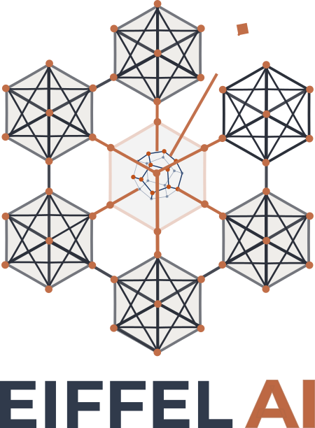

<p align="center">
  
</p>

<h1 align="center">noos&phi; — Prototype Dashboard</h1>

<p align="center">
  <strong>Mesurer la conscience collective en temps r&eacute;el</strong><br/>
  Prototype de visualisation des sources de donn&eacute;es RNG quantiques
</p>

<p align="center">
  D&eacute;velopp&eacute; par <strong>EIFFEL AI</strong> — Alexandre Ferran<br/>
  Mars 2026
</p>

---

## Ce que c'est

Ce prototype est un **dashboard web** qui affiche en temps r&eacute;el le **z-index** provenant de plusieurs sources de nombres al&eacute;atoires quantiques, dans la lign&eacute;e du [Global Consciousness Project](https://global-mind.org) de l'Universit&eacute; de Princeton.

L'id&eacute;e : quand un &eacute;v&eacute;nement mondial synchronise les &eacute;motions de millions de personnes, des g&eacute;n&eacute;rateurs de nombres al&eacute;atoires quantiques r&eacute;partis sur la plan&egrave;te montrent des d&eacute;viations statistiquement significatives. Ce dashboard permet de **voir ces d&eacute;viations en direct** et de comparer plusieurs sources.

**Ce n'est pas l'application finale** — c'est un banc d'essai technique pour valider la faisabilit&eacute; et montrer le rendu visuel avant de lancer le d&eacute;veloppement de l'app mobile (React Native / Expo).

---

## Ce que vous allez y trouver

### Le cercle color&eacute; (le "Dot")

Un cercle lumineux au centre qui change de couleur selon l'&eacute;tat de la conscience collective :

| Couleur | Signification | Z-Index |
|---------|---------------|---------|
| Vert | Al&eacute;atoire normal, rien de sp&eacute;cial | |z| < 1 |
| Jaune | L&eacute;g&egrave;re coh&eacute;rence d&eacute;tect&eacute;e | 1 &le; |z| < 1.5 |
| Orange | Coh&eacute;rence significative | 1.5 &le; |z| < 2 |
| Rouge | Anomalie forte (tr&egrave;s rare) | |z| &ge; 2 |

### Les 5 sources de donn&eacute;es

L'app combine **5 sources** de nombres al&eacute;atoires, chacune activable/d&eacute;sactivable :

| Source | Origine | Frequence | Ce qu'elle mesure |
|--------|---------|-----------|-------------------|
| **Mondial** (Princeton, USA) | ~60 capteurs quantiques r&eacute;partis sur la plan&egrave;te | 1/min | La coh&eacute;rence du r&eacute;seau mondial depuis 1998 |
| **QCI uQRNG** (USA) | G&eacute;n&eacute;rateur photonique quantique cloud | 1/sec | Al&eacute;atoire quantique photonique en temps r&eacute;el |
| **Quantique** (ANU, Australie) | G&eacute;n&eacute;rateur photonique de l'Australian National University | 1/min | Al&eacute;atoire quantique pur via des photons |
| **NIST Beacon** (USA) | Service gouvernemental am&eacute;ricain | 1/min | 512 bits d'entropie v&eacute;rifiable chaque minute |
| **Votre machine** | Le processeur de l'appareil qui fait tourner l'app | 1/sec | Bruit thermique local (10 trials de 200 bits) |

### Les boutons (en bas &agrave; droite)

| Bouton | Ic&ocirc;ne | Action |
|--------|-------|--------|
| **Sessions enregistr&eacute;es** | Grille | Ouvre la liste des sessions sauvegard&eacute;es |
| **Session** | Cercle + point | Enregistrer une session (solo ou collective) |
| **Historique** | Courbe ECG | Graphique 24h glissant avec toutes les sources |
| **Son** | Haut-parleur | Active/d&eacute;sactive le son + volume (pilule verticale) |

### Pendant une session

- **La croix (X)** ferme la fen&ecirc;tre mais l'enregistrement **continue en fond**
- **Le bouton session** (blanc invers&eacute;) indique qu'une session est en cours — cliquez dessus pour revenir &agrave; l'enregistrement
- **La pastille rouge en haut** montre le temps &eacute;coul&eacute; — cliquez dessus pour revenir aussi
- **Pause / Reprendre** : met l'enregistrement en attente (le bouton session affiche des barres de pause)
- **Arr&ecirc;ter** : sauvegarde la session

### Sessions collectives

1. Choisissez "Session collective" dans l'&eacute;cran de session
2. Un code (ex: `NOOS-ABCD`) est g&eacute;n&eacute;r&eacute;
3. Partagez-le via le bouton partage (Telegram, WhatsApp, Signal...)
4. Les participants rejoignent avec le code
5. Le z-score combine les RNG de tous les appareils connect&eacute;s

### Le son

Un **soundscape m&eacute;ditatif** r&eacute;actif au z-score :
- **z ~ 0** : drone grave (tanpura), &agrave; peine audible
- **|z| > 0.3** : nappe de cordes chaude
- **|z| > 0.7** : violoncelle m&eacute;lodique (suit la gamme choisie)
- **|z| > 1** : bols tib&eacute;tains frapp&eacute;s
- **|z| > 1.5** : cloches
- **|z| > 2** : gongs profonds + sph&egrave;re photo de Franck appara&icirc;t

6 gammes disponibles (432 Hz) : libre, pentatonique, majeure, mineure, dorienne, chromatique.

### Le score combin&eacute; (Stouffer)

L'app fusionne toutes les sources actives en un **score unique** via la m&eacute;thode statistique de Stouffer. Plus il y a de sources, plus la mesure est fiable. Voir **[METHODOLOGY_ZSCORE.md](METHODOLOGY_ZSCORE.md)** pour les d&eacute;tails.

---

## Installation

### Pr&eacute;requis

- **Node.js** version 18 ou sup&eacute;rieure ([t&eacute;l&eacute;charger ici](https://nodejs.org))
- Un terminal (Terminal sur Mac, PowerShell sur Windows, ou tout &eacute;quivalent)
- Une connexion internet (pour recevoir les donn&eacute;es des capteurs mondiaux)

### &Eacute;tapes

```bash
# 1. Cloner le d&eacute;p&ocirc;t
git clone https://github.com/Motokiyo/noosphi.git
cd noosphi

# 2. Installer les d&eacute;pendances
npm install

# 3. (Optionnel) Configurer QCI uQRNG
# Cr&eacute;er un fichier .env avec votre token QCI :
echo "QCI_TOKEN=votre_token_ici" > .env

# 4. Lancer le serveur
npm start
```

Ouvrez :
- **http://localhost:3000/experience.html** — Experience Noosfeerique (sphere 3D)
- **http://localhost:3000/** — Dashboard prototype

Le terminal affichera :

```
  ╔═══════════════════════════════════════════╗
  ║         noosφ — Prototype Dashboard       ║
  ║                                           ║
  ║   http://localhost:3000                   ║
  ║                                           ║
  ║   Sources: GCP + ANU QRNG + NIST + Local  ║
  ╚═══════════════════════════════════════════╝
```

**Ouvrez http://localhost:3000 dans votre navigateur.**

Les donn&eacute;es mettent quelques secondes &agrave; arriver (le serveur de Princeton est aux &Eacute;tats-Unis). Le graphe ajoute un nouveau point chaque minute.

### Arr&ecirc;ter le dashboard

Faites `Ctrl+C` dans le terminal.

---

## Ce qui se passe sous le capot

```
Votre navigateur  ──►  Serveur local (Express)  ──►  APIs externes
                       http://localhost:3000
                              │
                              ├──► global-mind.org (Princeton)
                              ├──► qrng.anu.edu.au (Australie)
                              ├──► beacon.nist.gov (USA)
                              └──► crypto du processeur (local)
```

Le serveur local sert de **relais** entre votre navigateur et les APIs mondiales. Il :

- R&eacute;cup&egrave;re les donn&eacute;es de Princeton toutes les minutes
- Demande des nombres quantiques &agrave; l'Australie (avec cache pour respecter les limites)
- Re&ccedil;oit les pulses du NIST Beacon
- G&eacute;n&egrave;re des nombres al&eacute;atoires localement via le processeur de votre machine
- Calcule les z-scores et les combine
- Envoie tout &agrave; votre navigateur en JSON

**Aucune donn&eacute;e personnelle n'est collect&eacute;e ni transmise.**

---

## Structure du projet

```
noosphi/
├── server.js             ← Serveur (proxy APIs + RNG local)
├── public/
│   ├── index.html        ← Page du dashboard
│   ├── favicon.svg       ← Ic&ocirc;ne de l'onglet
│   ├── css/style.css     ← Th&egrave;me visuel (dark)
│   └── js/
│       ├── zindex.js     ← Calculs statistiques (Stouffer, CDF)
│       ├── charts.js     ← Graphiques (Chart.js)
│       └── app.js        ← Logique (polling, affichage, toggles)
├── docs/
│   └── eiffel-ai-logo.png
├── ARCHITECTURE.md       ← Documentation technique d&eacute;taill&eacute;e
├── package.json
└── .gitignore
```

---

## D&eacute;tection automatique de l'appareil

Le dashboard d&eacute;tecte automatiquement le type de machine sur laquelle il tourne et l'affiche dans l'interface :

| Plateforme | Affichage |
|------------|-----------|
| MacBook / iMac (Apple Silicon) | Mac Apple Silicon |
| MacBook / iMac (Intel) | Mac Intel |
| PC sous Windows | PC Windows |
| PC sous Linux | PC Linux |
| Raspberry Pi | Raspberry Pi |
| Android (via Termux) | Android |

---

## Co&ucirc;t

- **Toutes les sources de donn&eacute;es sont gratuites**
- Le dashboard tourne en local, aucun h&eacute;bergement n&eacute;cessaire
- Seule d&eacute;pendance : `express` (serveur web Node.js)

---

## Feuille de route

Le prototype v1.0.0 est fonctionnel et d&eacute;ploy&eacute;. Prochaines &eacute;tapes :

1. **Phase 3** — Navigation compl&egrave;te : Festival Noosf&eacute;erique, Projet, Profil, Param&egrave;tres avanc&eacute;s
2. **Phase 4** — Conway sur sph&egrave;re : photos rondes, circle packing, mapping 360
3. **App finale** — React Native + Expo SDK 52 + Supabase + comptes utilisateurs

**Deadline** : Festival Noosf&eacute;erique, 3-4 octobre 2026

---

## Acc&egrave;s en ligne

**https://noosfeerique.leparede.org/experience.html**

---

## Documentation technique

- **[METHODOLOGY_ZSCORE.md](METHODOLOGY_ZSCORE.md)** — Comment le z-score est calcul&eacute; et harmonis&eacute; entre toutes les sources (m&eacute;thode Princeton EGG, 200 bits/trial, Stouffer)
- **[ARCHITECTURE.md](ARCHITECTURE.md)** — Architecture du prototype, flux de donn&eacute;es
- **[CHANGELOG.md](CHANGELOG.md)** — Historique des versions

---

## D&eacute;couverte technique

Lors du d&eacute;veloppement, nous avons constat&eacute; que le service **ETH Zurich QRNG** (`qrng.ethz.ch`), pr&eacute;vu comme source de secours dans la proposition, est **hors service** (le DNS ne r&eacute;sout plus). Deux alternatives fonctionnelles ont &eacute;t&eacute; int&eacute;gr&eacute;es :

- **ANU QRNG** (Australian National University) — g&eacute;n&eacute;rateur photonique quantique, fonctionnel
- **NIST Beacon 2.0** — service gouvernemental US, gratuit, fiable
- **QCI uQRNG** — g&eacute;n&eacute;rateur photonique quantique cloud, 1 milliard bits/mois gratuit

## Remerciements

Nous remercions [**Quantum Computing Inc. (QCI)**](https://www.quantumcomputinginc.com/products/commercial-products/uqrng) de nous avoir aimablement accord&eacute; l'acc&egrave;s &agrave; leur API **uQRNG** avec un quota de 1 milliard de bits quantiques par mois, nous permettant de tester et d&eacute;velopper cette application avec une source photonique quantique en temps r&eacute;el.

---

<p align="center">
  <br/>
  <strong>EIFFEL AI</strong><br/>
  <em>Alexandre Ferran</em><br/>
  <sub>noos&phi; — Mesurer la conscience collective en temps r&eacute;el</sub>
</p>
